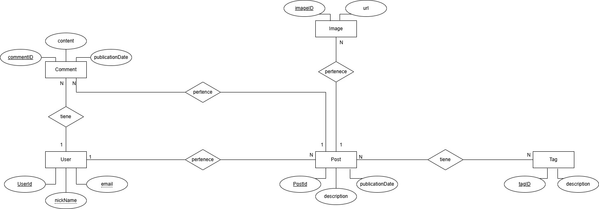
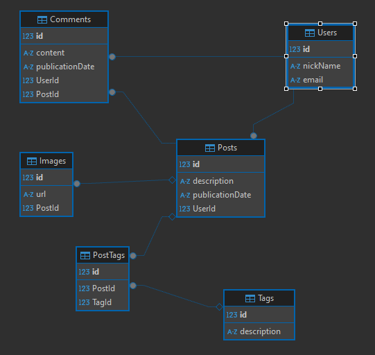

# 🧠 UnaHur Anti-Social Net (Backend)

Backend desarrollado para la red social **"UnaHur Anti-Social Net"**, un MVP académico que permite a usuarios registrados crear publicaciones, comentar, y asociar imágenes y etiquetas a los posteos.

## 📌 Tabla de Contenidos

- [⚙️ Instalación y Configuración](#%EF%B8%8F-instalación-y-configuración)
- [✨ Características](#-características)
- [📦 Stack Tecnológico](#-stack-tecnológico)
- [📁 Estructura del Proyecto](#estructura-del-proyecto)
- [🗃️ Documentación de Base de Datos](#%EF%B8%8F-documentación-de-base-de-datos)
- [📚 Documentación de la API](#-documentación-de-la-api)
- [📥 Colecciones de Prueba](#-colecciones-de-prueba-1)
- [🧑‍💻 Autores](#-autores)

## ⚙️ Instalación y Configuración


#### 🛠️ Herramientas necesarias:

**[Git ](https://git-scm.com/downloads)** 
**(Necesario)** Para poder clonar el repositorio.

**[ NodeJs ](https://nodejs.org/en)** **(Necesario)** Para correr el backend.

**[ Postman  ](https://www.postman.com/downloads/)** **(Opcional)** Para ejecutar las colecciones de prueba.

**[ Visual Studio Code ](https://code.visualstudio.com/)**
**(Opcional)** Para visualizar el codigo. 

#### 1. 🔁 Clonar el repositorio:
 - Abrimos una terminal bash o cmd, y ejecutamos el siguiente comando para clonar el repositorio en la PC: 

``` 
git clone https://github.com/EP-UnaHur-2025C1/anti-social-relational-persidev.git

```
- Nos movemos a la carpeta del proyecto:
```
cd anti-social-relational-persidev
```

#### 2. 📦 Instalamos dependencias:
- Ejecutamos el siguiente comando para instalar dependencias: 
```
npm install
```

#### 3. 🔧 Configuramos la variable de entorno:

- Creamos un archivo `` .env `` en el directorio raíz de nuestro proyecto, la estructura tiene que quedar así:

```
anti-social-relational-persidev
├── src/
├── .env
├── .gitIgnore
├── package-lock.json
├── package.json
├── README.md

```
- Creamos las siguientes variables:
  
  - ` PORT = 3000 ` para configurar el puerto en que se ejecutara nuestra aplicacion, por defecto se ejecuta en el puerto ` 3001`

> [!NOTE]  
> Para ejecutar las colecciones de prueba tiene que estar configurado en el puerto 3000 


  - ` MONTHS = 7` para configurar la visibilidad de los comentarios de un post, por defecto son ` 6`


#### 4. 🚀 Iniciamos el servidor:
```
npm run dev
```
> [!NOTE]  
> En nuestro `app.js` comentamos la linea `21` para no estar creando constantemente las tablas. Debe quedar así: `//await db.sequelize.sync({ force: true })`

## ✨ Características:

- ✅ CRUD completo de:
  - Usuarios
  - Publicaciones
  - Comentarios
  - Etiquetas
  - Imágenes asociadas
- ✅ Visibilidad de comentarios condicionada por antigüedad (configurable por variable de entorno).
- ✅ Documentación completa generada por Swagger .
- ✅ Variables de entorno para configuración flexible.


## 📦 Stack Tecnológico

* **NodeJs:** Ejecuta codigo JS en nuestro backend.
* **ExpressJs:** Framework que facilita la creacion del servidor.
* **Sequelize:** ORM que facilita la migracion a cualquier base de datos.
* **Sequelize-cli:** Facilita la creacion de tablas por linea de comando.
* **Sqlite3:** Motor de base de datos ligero para crear un backend
* **Joi:** Crea esquemas de validación.
* **Dotenv:** Permite acceso a las variables de entorno.
* **Nodemon:** Ejecutar el servidor.
* **Postman:** Ejecutar las colecciones de prueba.
* **Swagger:** Creacion de la documentacion 
## Estructura del Proyecto

```text
anti-social-relational-persidev/
│   .env             # Variable de entorno
│   .gitignore         
│   package.json     # Archivo de configuracion de nuestro servidor
│   README.md
├── coleccionesDePrueba/ # Colecciones para realizar pruebas
└── src/
    ├── app.js       # Creacion de aplicacion de express y sincronizacionde BD.
    ├── main.js 
    │ 
    ├── controllers/ # Controladores de nuestro servidor(Logica de cada endpoint)
    ├── middlewares/ # Validadores de datos
    ├── routes/      # Definicion de las rutas
    ├── schemas/     # Definicion de los esquemas de validaciones
    ├── docs/        # Configuracion de la documentacion 
    └── db/
        ├── config/      # Configuracion de BD
        ├── migrations/  
        ├── models/      # Modelos de nuestra BD
        └── seeders/
```
## 🗃️ Documentación de Base de Datos


📌 **Descripcion General:**  
    Esta base de datos almacena la información principal para UnaHur anti-social net. Incluye tablas para usuarios, publicaciones, comentarios, tags e imagenes y sus relaciones.
 
  

🏗️ **Estructura de Tablas:**

##### 📋 User:

| Columna    | Tipo      | Descripción                     |
| ---------- | --------- | ------------------------------- |
| id         | INT **(PK)**  | Identificador único del usuario |
| nickName   | STRING   | Nombre del usuario (Unico)      |
| email      | STRING   | Correo electrónico (único)      |

##### 📋 Post:

| Columna    | Tipo      | Descripción                     |
| ---------- | --------- | ------------------------------- |
| id         | INT **(PK)**  | Identificador único del Post |
| description| STRING   | Descripcion que acompaña al post      |
| publicationDate| STRING   | Fecha de publicación del post    |
| UserId|INT **(FK)** | FK para relacionar el usuario con el post|

##### 📋 Image:

| Columna    | Tipo      | Descripción                     |
| ---------- | --------- | ------------------------------- |
| id         | INT **(PK)**  | Identificador único de la imagen |
| url| STRING   | Link para acceder a la imagen      |
| PostId|INT **(FK)** | FK para relacionar la imagen con el Post|

##### 📋 Comentario:

| Columna    | Tipo      | Descripción                     |
| ---------- | --------- | ------------------------------- |
| id         | INT **(PK)**  | Identificador único del comentario |
| content| STRING   | Contenido del comentario   |
|publicationDate|STRING|Fecha en que realizó el comentario|
|UserId|INT **(FK)**| FK para relacionar el comentario con un usuario|
| PostId|INT **(FK)** | FK para relacionar el comentario con un post|

##### 📋 Tag:

| Columna    | Tipo      | Descripción                     |
| ---------- | --------- | ------------------------------- |
| id         | INT **(PK)**  | Identificador único del Tag |
| description| STRING   | Contenido del Tag  |  


**🔗 Relaciones entre Tablas**

- Un `User` puede tener muchos `Posts`, pero un `Post` pertenece a un unico `User`.
- Un `User` puede tener muchos `Comments`, pero un `Comment` pertenece a un unico `User`.
- Un `Post` puede tener muchos `Comments`, pero un `Comment` pertenece a un unico `Post`.
- Un `Post` puede tener muchas `Images`, pero una `Image` pertenece a un unico `Post`.
- Un `Post` puede tener muchas `Tags`, y una `Tag` puede tener muchos `Posts`


**DER**

Diagrama entidad relacion de las tablas:



**MER**

Modelo entidad relacion:





## 📚 Documentación de la API:

Accesible desde el navegador en:

```
http://localhost:3000/api-docs
```

Incluye:

  - Endpoints CRUD por entidad

  - Esquemas de validación

  - Ejemplos de respuestas y errores

## 📥 Colecciones de prueba:

- Incluye archivos como por ejemplo `coleccionesDePrueba/user.postman.json` para probar el funcionamiento de la aplicacion con cada una de las tablas de nuestra base de datos. 


## 🧑‍💻 Autores

 - Brenda Lera     - Estudiante de universidad de Hurlingham
 - Melina Alvarez  - Estudiante de universidad de Hurlingham
 - Álvaro Bravo    - Estudiante de universidad de Hurlingham
 - Roberto Galeano - Estudiante de universidad de Hurlingham